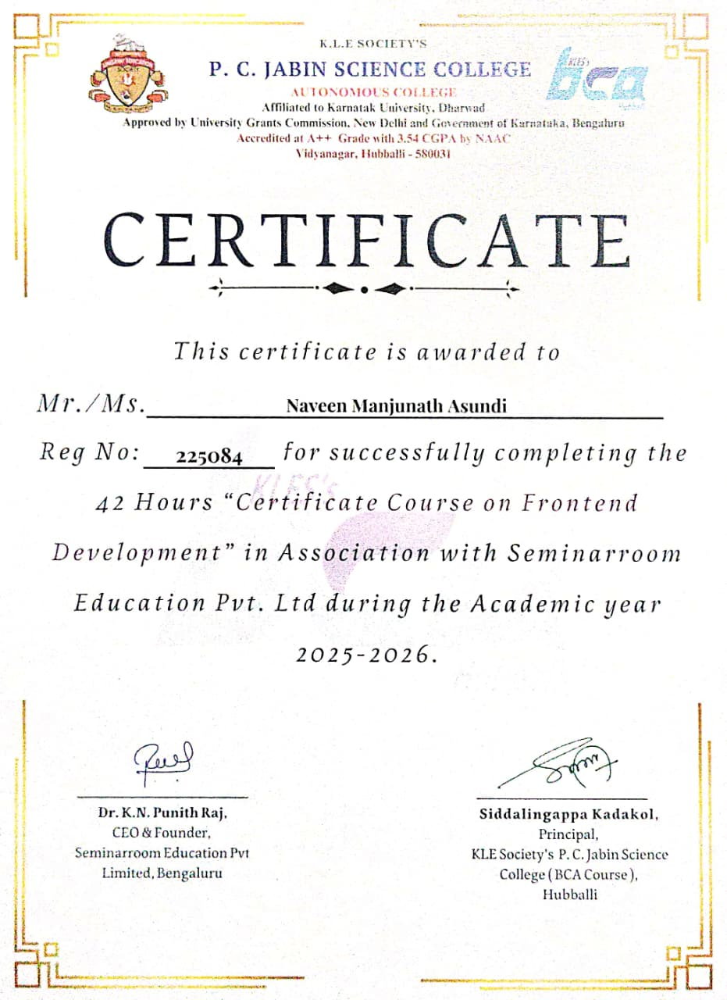
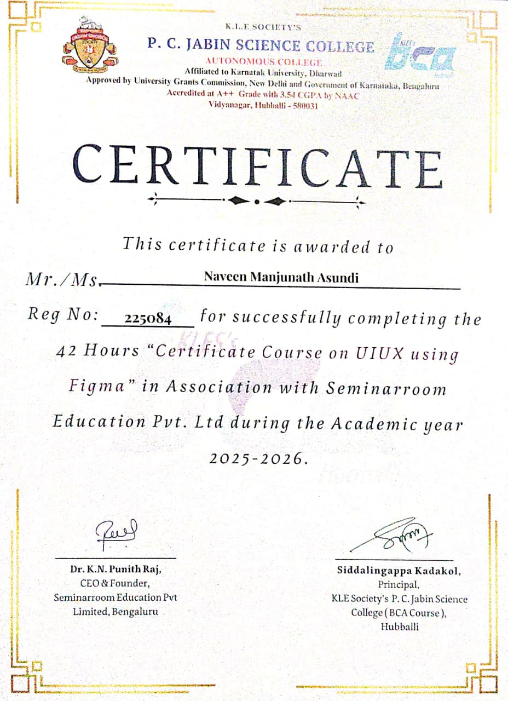
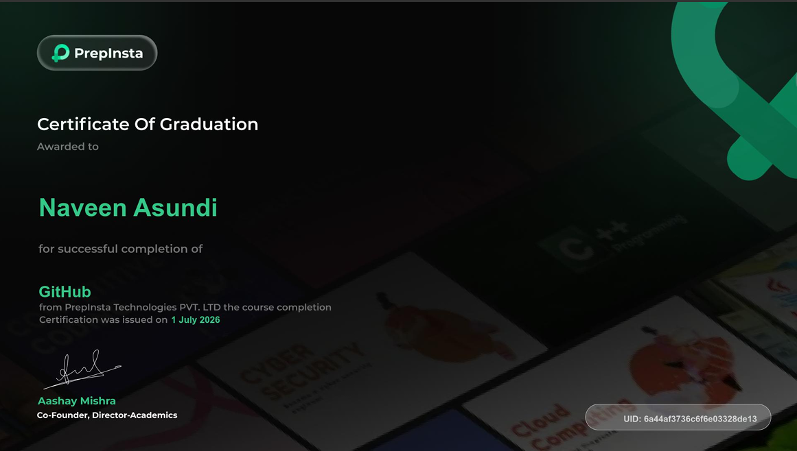
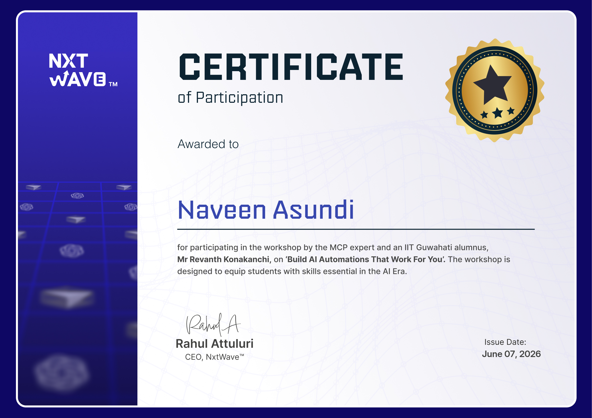

# My Certifications

## Frontend Development Certificate
Issued by: PC Jabin Science College  
Course: Certificate Course on Frontend Development  
Duration: 42 Hours  
Year: 2025-2026

## 2. UI/UX using Figma.
Institution: P. C. Jabin Science College.
Duration: 42 Hours.
Tools: Figma.
Year: 2025–2026.

## 3. GitHub Course – PrepInsta
- Course Completion Certificate
- Skills: Git, GitHub, Version Control
- Issued: 1 July 2026
- 

## 4. AI Automation Workshop – NxtWave
- Participation Certificate
- Workshop: Build AI Automations That Work For You
- Issued: 7 June 2026
- 

